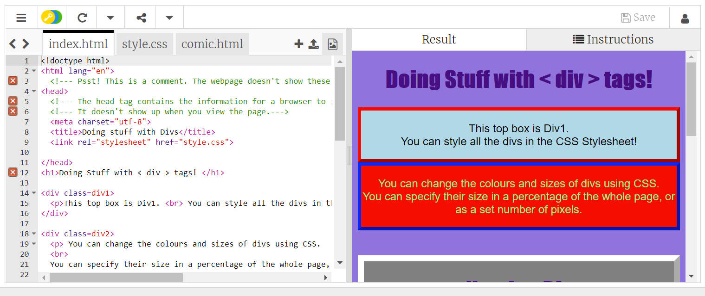

## Introduction

In this project you'll use the HTML ```<div>``` tag to create the panels of a comic! 

### What you will make

--- no-print ---
<div>
  <iframe src="https://trinket.io/embed/html/780d3e38c5" width="100%" height="600" frameborder="0" marginwidth="0" marginheight="0" allowfullscreen></iframe>
</div>
--- /no-print ---

--- print-only ---

--- /print-only ---

--- collapse ---
---
title: What you will need
---
### Hardware

+ A computer or tablet

### Software

+ This project can be completed in a web browser using [trinket.io](https://trinket.io/) or [repl.it](https://replit.com/)
+ You can also use an offline code editor like [Visual Studio Code](https://code.visualstudio.com/Download) (or even just notepad!)


### Downloads

+ Download the project [starter file](http://rpf.io/p/en/webcomic-go){:target="_blank"} if working offline

--- /collapse ---

--- collapse ---
---
title: What you will learn
---

+ HTML is used to structure websites and CSS is used to style them.
+ HTML uses tags to construct websites, one of the most used tags is ```<div>```
+ ```<div>``` is used to create sections of the page which can be styled independently of one another with CSS

--- /collapse ---

--- collapse ---
---
title: Additional information for educators
---

You can download the completed project [here](http://rpf.io/p/en/webcomic-get){:target="_blank"}.

If you need to print this project, please use the [printer-friendly version](https://projects.raspberrypi.org/en/projects/webcomic/print){:target="_blank"}.

--- /collapse ---
