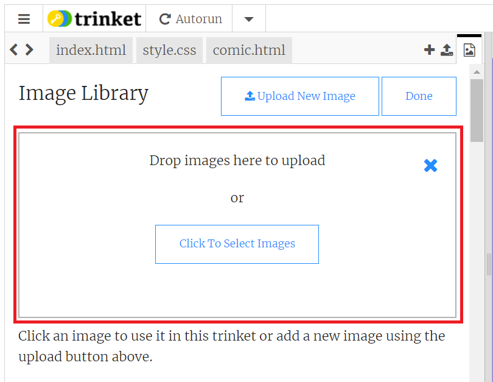

## Adding Images

In the last step, we got to grips with ```<div>```s and how they can break a website into sections. 

In this step, you're going to change the content of a series of divisions by adding images to them using HTML. 

--- task ---
Open the ```index.html``` file to see the starter page.
--- /task ---

--- task ---
Look at the code for our ```index.html``` web page. Inside the ```<body>``` tags there are **five** divisions -  a ```title``` division and four ```panel``` divisions.

You're going to change the information in these panels by changing the `````` tag to the image you would like to use, and changing the text to caption the picture.
--- /task ---
 
First, let's choose the pictures that will go in our comic panels. There are several images saved in the starter project that you can use, or you can use your own images if you prefer. 

--- task ---
**If you are using Trinket:** you can click the **Manage Images** icon at the top of your trinket window, which will bring up a list of the images you have available:


This will open the Images list, which will show you the names of all the images you can use in your code. Make a note of the filenames of the images you want to use, including their file extension (the part after the dot!)


--- collapse ---
---
title: Importing your own images in Trinket
---

Importing your own images in Trinket is quite simple: 

From the **Manage Images** menu, click the blue button at the top which says **+ Image Library**:


This will open a new menu showing all the pictures currently saved in the gallery for this Trinket. Click the Blue button at the top of the menu which says **Upload New Image**:


A box will appear at the top of the Manage Images Menu, which contains a blue box saying **Click to Select Images**. 


You can either: 
+ Drag and drop files from your file manager into this box to add them to your project or
+ Click the blue button and select files individually to upload them to your project

When you have selected or dragged all the images you want to add, click the blue **Done** button.


--- /collapse ---

**If you are working in an offline editor:** Inside the folder containing the starter project, you should see a list of image files. As long as your images are stored in this folder, you can simply just reference them in your code using their filenames in the next step. Easy!

--- /task ---

--- task ---
In your ```index.html``` file, scroll down to line 26. This is the tag which contains the reference for the image in the first panel.
```html

```
On this line, simply change the name of the image in the quotation marks to the one you would like as your first panel image. So, if you wanted to have ```birb1.png``` as your image, your code would say:
```html

```
Do this now and watch the image in your first panel change!
--- /task ---

--- task ---
Go through the rest of your panels and add the correct images to the code in the right places. Remember to include the file extension in your tag, or it won't work!
--- /task ---

--- save ---